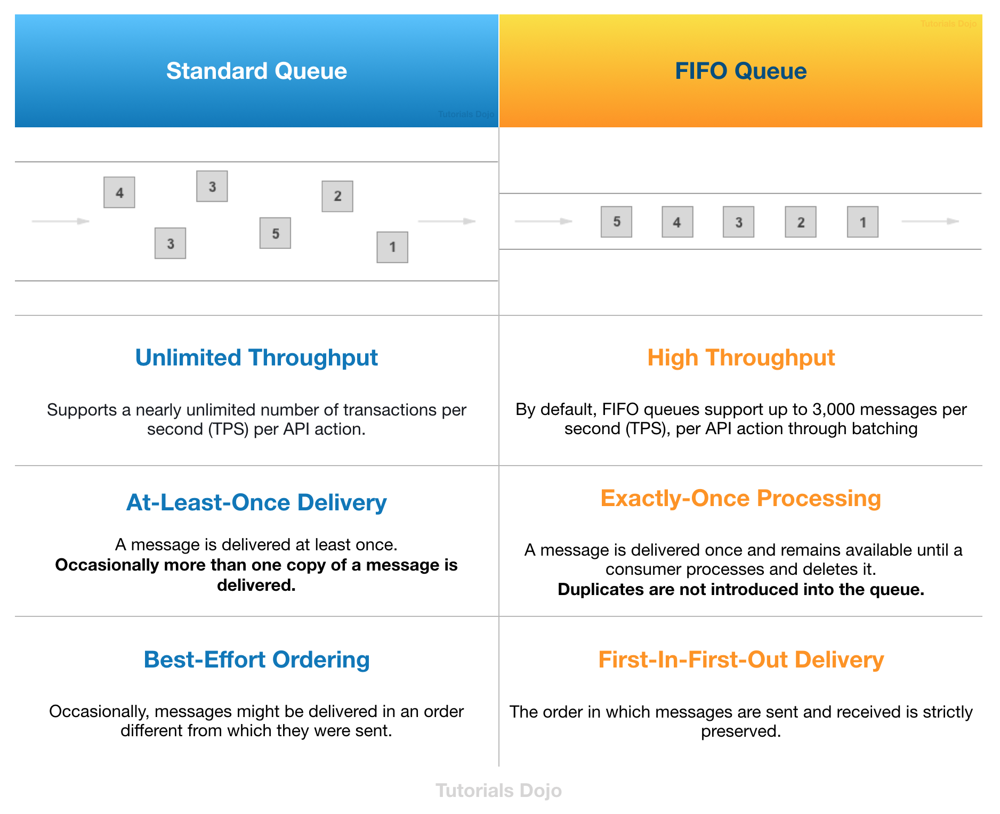
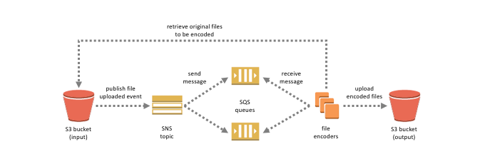

Amazon SQS FIFO (First-In-First-Out) Queues have all the capabilities of the standard queue with additional capabilities designed to enhance messaging between applications when the order of operations and events is critical, or where duplicates can't be tolerated, for example:

- Ensure that user-entered commands are executed in the right order.
- Display the correct product price by sending price modifications in the right order.
- Prevent a student from enrolling in a course before registering for an account.

## A fanout pattern for S3 + SNS + SQS:

Because the s3 event can only send messages to a single SQS or SNS at a time, so if you want to do multiple messages at a time you need to use the event driven fanout pattern.

## SQS vs Kinesis Data Streams

Kinesis Data Streams is a real-time data streaming service that requires the provisioning of shards.

Amazon SQS is a cheaper option because you only pay for what you use.

If there is no requirement for real-time processing in the scenario given, replacing Kinesis Data Streams with Amazon SQS would save more costs.
