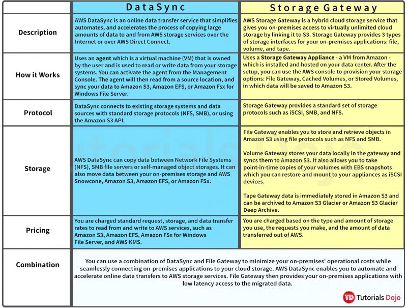

AWS DataSync is primarily used to migrate existing data to Amazon S3.

On the other hand, AWS Storage Gateway is more suitable if you still want to retain access to the migrated data and for ongoing updates from your on-premises file-based applications.

If there is no need to set up a hybrid cloud storage, then should use AWS DataSync rather than AWS Storage Gateway.

AWS DataSync makes it simple and fast to move large amounts of data online between on-premises storage and Amazon S3, Amazon Elastic File System (Amazon EFS), or Amazon FSx for Windows File Server.

Although you can copy data from on-premises to AWS with Storage Gateway, it is not suitable for transferring large sets of data to AWS. Storage Gateway is mainly used in providing low-latency access to data by caching frequently accessed data on-premises while storing archive data securely and durably in Amazon cloud storage services. Storage Gateway optimizes data transfer to AWS by sending only changed data and compressing data.
