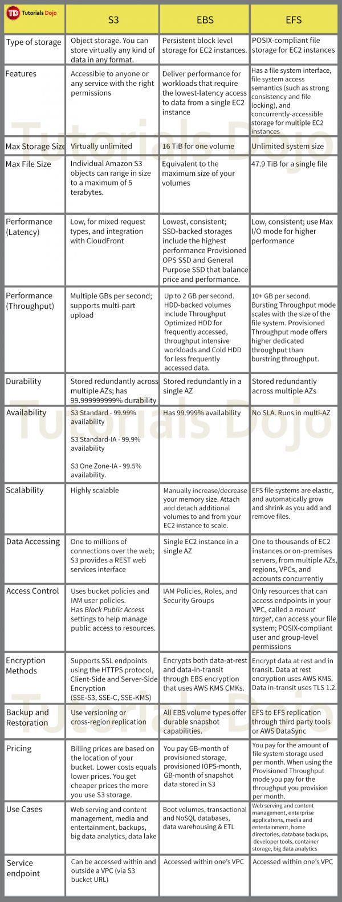

## EBS

You may attach EBS Volumes to instances at either `run-time` or `boot-time`.

When you create an EBS volume in an Availability Zone, it is `automatically replicated within that zone only`, and not on a separate AWS region, to prevent data loss due to a failure of any single hardware component.

EBS volumes can only be attached to an EC2 instance `in the same Availability Zone`.

Amazon EBS provides the ability to create snapshots (backups) of any EBS volume and write a copy of the data in the volume to `Amazon S3`, where it is stored redundantly in multiple Availability Zones.

Amazon EBS encryption uses 256-bit Advanced Encryption Standard algorithms (AES-256)

When you create an encrypted EBS volume and attach it to a supported instance type, the following types of data are encrypted:

- Data at rest inside the volume

- All data moving between the volume and the instance

- All snapshots created from the volume

- All volumes created from those snapshots

## S3

Amazon S3 now provides increased performance to support at least `3,500 requests per second to add data and 5,500 requests per second to retrieve data`.

The Amazon S3 notification feature enables you to receive notifications when certain events happen in your bucket.

To enable notifications, you must first add a notification configuration identifying the events you want Amazon S3 to publish, and the destinations where you want Amazon S3 to send the event notifications.

Amazon S3 supports the following destinations where it can publish events:

    1. Amazon Simple Notification Service (Amazon `SNS`) topic - A web service that coordinates and manages the delivery or sending of messages to subscribing endpoints or clients.

    2. Amazon Simple Queue Service (Amazon `SQS`) queue - Offers reliable and scalable hosted queues for storing messages as they travel between computer.

    3. AWS `Lambda` - AWS Lambda is a compute service where you can upload your code and the service can run the code on your behalf using the AWS infrastructure. You package up and upload your custom code to AWS Lambda when you create a Lambda function

## EFS

In this question, you should take note of the two keywords/phrases: "file operation" and "allows concurrent connections from multiple EC2 instances". There are various AWS storage options that you can choose but whenever these criteria show up, always consider using EFS instead of using EBS Volumes which is mainly used as a "block" storage and can only have one connection to one EC2 instance at a time. Amazon EFS provides the scale and performance required for big data applications that require high throughput to compute nodes coupled with read-after-write consistency and low-latency file operations.
