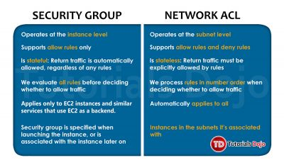

Think of a VPC as a `Virtual Data Center` in the cloud.

AWS VPC lets you provision a logically isolated section of AWS Cloud.

When we create a new VPC, we by default create the following things:

    1. Route Table
    2. Network ACL
    3. Security Group

You can only assign one internet gateway to a single VPC.

Amazon always reserves 5 IP addresses within your subnets.

Security Groups cannot span VPCs.

## Create instance in VPC Default vs VPC Non-Default

By default, a "default subnet" of your VPC is actually a public subnet, because the main route table sends the subnet's traffic that is destined for the internet to the internet gateway. You can make a default subnet into a private subnet by removing the route from the destination 0.0.0.0/0 to the internet gateway. However, if you do this, any EC2 instance running in that subnet can't access the internet.

Instances that you launch into a default subnet receive both a public IPv4 address and a private IPv4 address, and both public and private DNS hostnames. Instances that you launch into a nondefault subnet in a default VPC don't receive a public IPv4 address or a DNS hostname. You can change your subnet's default public IP addressing behavior

The following VPC peering connection configurations are not supported.

    1. Overlapping CIDR Blocks

    2. Transitive Peering

    3. Edge to Edge Routing Through a Gateway or Private Connection

When you launch an EC2 instance into a default VPC, AWS provides it with public and private DNS hostnames that correspond to the public IPv4 and private IPv4 addresses for the instance.

However, when you launch an instance into a non-default VPC, AWS provides the instance with a private DNS hostname only. New instances will only be provided with public DNS hostname depending on these two DNS attributes: the DNS resolution and DNS hostnames, that you have specified for your VPC, and if your instance has a public IPv4 address.

## Connect your network with your VPC

By default, instances that you launch into a virtual private cloud (VPC) can't communicate with your own network. You can enable access to your network from your VPC by attaching a virtual private gateway to the VPC, creating a custom route table, updating your security group rules, and creating an AWS managed VPN connection.

## VPC endpoint

A VPC endpoint enables you to privately connect `your VPC` to supported `AWS services` and VPC endpoint services powered by AWS PrivateLink without requiring an internet gateway, NAT device, VPN connection, or AWS Direct Connect connection.

Instances in your VPC do not require public IP addresses to communicate with resources in the service. Traffic between your VPC and the other service does not leave the Amazon network.

When you create a VPC endpoint, you can attach an endpoint policy that controls access to the service to which you are connecting. You can modify the endpoint policy attached to your endpoint and add or remove the route tables used by the endpoint. An endpoint policy does not override or replace IAM user policies or service-specific policies (such as S3 bucket policies). It is a separate policy for controlling access from the endpoint to the specified service.
